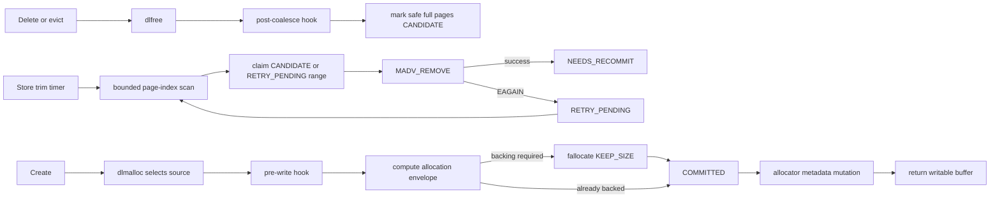
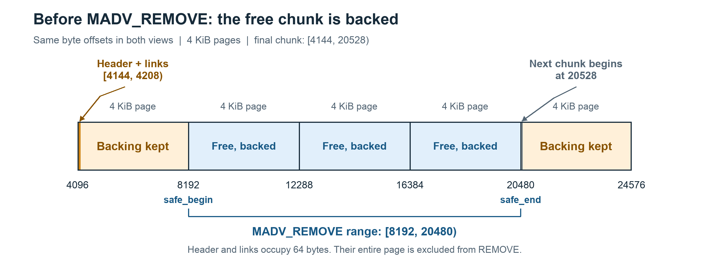
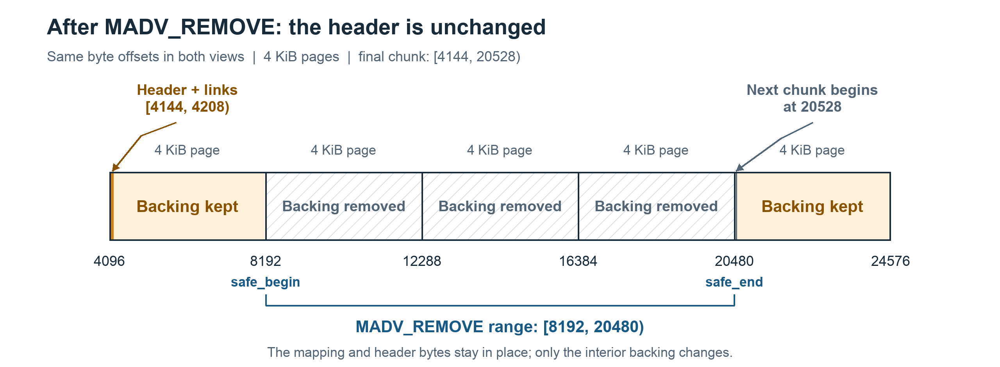
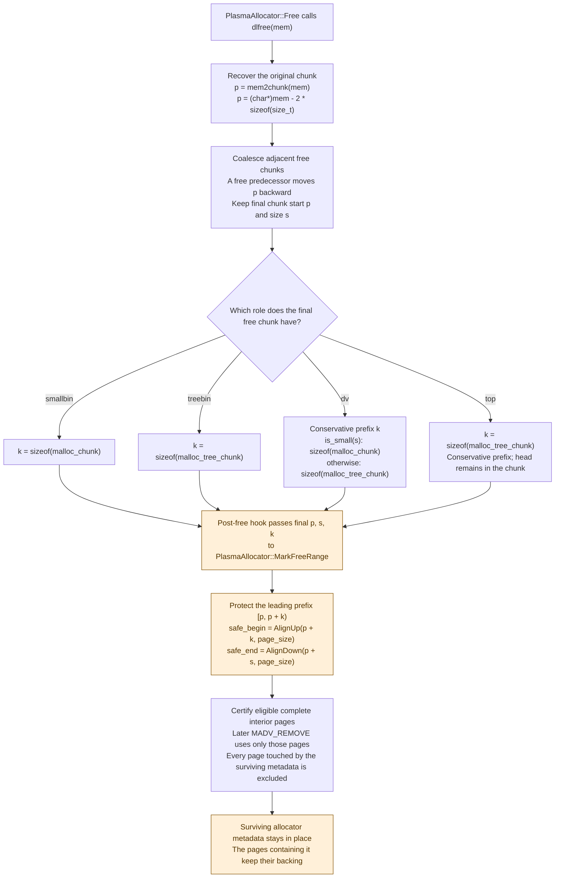
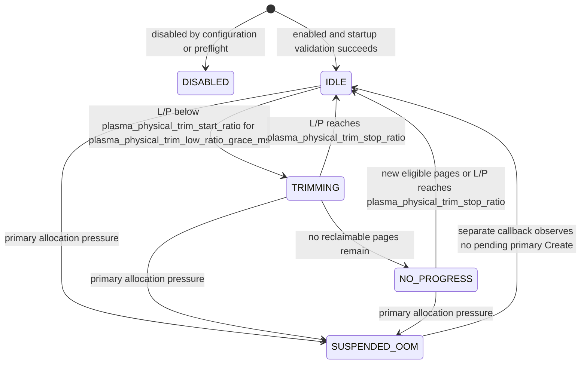

# REP: Reclaim Physical Backing from Free Pages in the Plasma Object Store

## Summary

This REP proposes an opt-in, Linux-only mechanism for returning the physical
backing of free pages in the Plasma object store's primary shared-memory arena.
Today, deleting or evicting a Plasma object calls `dlfree()`: the allocation
becomes logically reusable, but pages that were touched generally remain backed
by tmpfs and continue to consume `/dev/shm` blocks until the arena is destroyed.

The proposal treats reclaim and safe reuse as one protocol. The raylet keeps a
fixed 2-bit state for every primary-arena page. A narrow dlmalloc hook certifies
metadata-safe page interiors after final free-chunk coalescing. A persistent
page-index cursor claims those candidates and calls
`madvise(..., MADV_REMOVE)` in bounded quantums. Before dlmalloc can mutate or
return any possibly sparse range, a second hook synchronously admits every
possibly sparse page in the allocation write set with
`fallocate(FALLOC_FL_KEEP_SIZE)`.

The central invariant is:

> Once this protocol is enabled for an arena, no page may be written by
> dlmalloc or exposed to a Plasma client while its backing is absent or
> uncertain.

If preparation fails, allocation stops before allocator topology is mutated,
before an object-table entry is inserted, and before a client receives a
writable buffer. The virtual mapping, file size, and non-moving object layout
remain intact.

The feature is disabled by default. The scope of this proposal is one
normal-page, tmpfs-backed primary arena on Linux. Fallback allocations, hugetlb
arenas, non-tmpfs mappings, and `preallocate_plasma_memory=true` are excluded. It
does not move live objects, replace spilling or eviction, or increase logical
object store capacity.

### General Motivation

#### Current behavior

The Plasma primary arena is a large, unlinked, `MAP_SHARED` file, normally in
`/dev/shm`. Object creation allocates a chunk from the arena and object deletion
returns that chunk to dlmalloc. In upstream Ray commit
[`71df155`](https://github.com/ray-project/ray/commit/71df1551d91571a5fef508b8330f401e90f86170),
the [allocator free path](https://github.com/ray-project/ray/blob/71df1551d91571a5fef508b8330f401e90f86170/src/ray/object_manager/plasma/plasma_allocator.cc#L122-L129)
is:

```cpp
dlfree(allocation.address_);
allocated_ -= allocation.size_;
```

This makes the address range available to a future Plasma allocation, but it
does not punch holes in the tmpfs file. Ray also deliberately rejects partial
`munmap` requests from dlmalloc so that the long-lived primary mapping is not
trimmed piecemeal
([source](https://github.com/ray-project/ray/blob/71df1551d91571a5fef508b8330f401e90f86170/src/ray/object_manager/plasma/dlmalloc.cc#L279-L307)).

As a result, three quantities can diverge substantially in a long-lived,
churn-heavy raylet:

- **Logical live bytes:** payload currently owned by Plasma objects.
- **Process RSS:** pages mapped into a particular process's page tables.
- **Allocated inode backing:** blocks allocated to the primary tmpfs inode,
  measured by `st_blocks * 512`.

Allocated inode backing is not the same as resident DRAM. It is nevertheless
the accounting domain that consumes `/dev/shm` capacity and that
`MADV_REMOVE` can release. For example, a 400 GiB arena may contain only 1 GiB
of live objects while close to 400 GiB of tmpfs blocks remain allocated. The
free chunks are reusable by Plasma, but that capacity cannot be used by
unrelated processes or other tmpfs files.

Sparse backing creates two distinct correctness problems. First, `ftruncate`
establishes the arena's file length without reserving every block. During arena
startup, dlmalloc may write sparse pages before the steady-state allocation hooks
are active; exhausting tmpfs, quota, or cgroup capacity at that point can trigger
the pre-existing `SIGBUS` failure mode. Sparse bootstrap covers that startup
window.

Separately, `MADV_REMOVE` deliberately makes selected pages sparse again. Before
such a page is reused, steady-state backing admission must synchronously restore
its backing before allocator mutation and client exposure; relying on a lazy
first-write fault is not acceptable.

[ray-project/ray#53261](https://github.com/ray-project/ray/issues/53261) reports
a closely related long-lived Plasma mapping problem. Configurable jemalloc for
workers ([ray-project/ray#47243](https://github.com/ray-project/ray/pull/47243))
addresses anonymous worker-heap fragmentation, but not Plasma's shared tmpfs
backing. A later, unmerged experiment
([ray-project/ray#62854](https://github.com/ray-project/ray/pull/62854)) used
worker-side `MADV_DONTNEED` to reduce a releasing worker's RSS. That can remove
the worker's page-table entries, but it intentionally leaves the shared tmpfs
data and backing available to other Plasma clients.

This REP addresses a different layer: after Plasma has actually deleted an
object and dlmalloc considers its chunk free, release the inode backing of
allocator-certified pages and safely readmit it before reuse.

#### Target workloads

The primary beneficiaries are long-lived Ray nodes with all of the following:

- large object stores, commonly tens or hundreds of GiB;
- repeated creation, eviction, deletion, and reuse of large immutable objects;
- working sets that can fall far below the arena's historical high-water mark;
- other node workloads that can make productive use of released memory or
  `/dev/shm` capacity.

The proposal is not intended to make a logically full object store accept more
objects. Object spilling and eviction remain responsible for logical capacity.
It is also not live-object compaction: live objects never move, and free regions
separated by live chunks do not become contiguous.

### Should this change be within `ray` or outside?

This change should be within `ray`.

Only Ray can place hooks at dlmalloc's final-coalesce and pre-metadata-write
commit points and order them with Plasma Create, Free, eviction, shutdown, and
error replies. An external process can observe a tmpfs file, RSS, or
`st_blocks`, but it cannot prove page ownership, exclude allocator metadata,
or prevent a sparse page from being mutated before backing admission.

## Stewardship

### Required Reviewers

- [@Kunchd](https://github.com/Kunchd) - Ray Core, raylet, and memory-management
  review.

Additional focused review from Plasma/object-spilling and Linux memory-management
owners is welcome before the proposal leaves draft.

### Shepherd of the Proposal (should be a senior committer)

[@Kunchd](https://github.com/Kunchd) - Ray Core shepherd for this proposal.

## Design and Architecture

### Terminology

| Term | Meaning in this REP |
|---|---|
| Primary arena | The long-lived shared tmpfs mapping from which Plasma normally allocates objects. Fallback files are outside this arena. |
| Chunk | A dlmalloc allocation unit, including allocator bookkeeping. A chunk can span pages, and a page can contain parts of multiple chunks. |
| Logical bytes (`L`) | Bytes currently allocated from the primary arena: `Allocated() - FallbackAllocated()`. Freeing an object reduces this quantity. |
| Backing bytes (`P`) | Blocks allocated to the primary tmpfs file, measured by `fstat(primary_fd).st_blocks * 512`. This is distinct from logical allocation and process RSS. |
| RSS / PTE | RSS measures resident mappings in one process; a page-table entry (PTE) maps a virtual page in that process. Dropping a mapping does not necessarily release shared file backing. |
| Candidate | A backed, complete page in an allocator-certified free interior, eligible for physical reclaim. |
| Recommit / backing admission | Synchronously reserving backing with `fallocate(FALLOC_FL_KEEP_SIZE)` before dlmalloc or a client may write a potentially sparse page. |
| Allocation envelope | The page-aligned range covering the selected allocation and source-local metadata writes needed to allocate or split its chunk. |
| Quantum / Store turn | One synchronous, budgeted trim callback. It returns to the Store event loop before a successor callback runs. |
| Primary allocation pressure | A pending primary-arena Create or an observed primary allocator OOM, including an OOM followed by successful eviction or fallback recovery. |

### Goals and non-goals

The design has the following goals:

- release allocated tmpfs backing, not only one process's RSS;
- never remove a page containing live object data or required dlmalloc
  metadata;
- admit backing before every possible write to a sparse or uncertain page;
- preserve the arena's virtual mapping and normal non-moving allocation model;
- make scan progress depend on fixed page indices rather than mutable chunk
  topology;
- bound work per Plasma Store turn and give Create/OOM handling priority; and
- fail closed whenever page state or backing is uncertain.

The proposed implementation does **not**:

- move live objects or compact the address space;
- replace spilling, eviction, or logical allocation limits;
- reclaim fallback allocations, hugetlb arenas, or non-tmpfs mappings;
- support non-Linux platforms;
- preserve the eager reservation contract of
  `preallocate_plasma_memory=true`;
- pre-fault every admitted page or protect against unrelated truncation,
  foreign hole punching, hardware faults, or every possible source of
  `SIGBUS`; or
- provide a hard wall-clock bound for a kernel `MADV_REMOVE` or `fallocate`
  syscall.

Capability failure before any hole is created may disable the experiment and
leave existing behavior unchanged. Once a page may be sparse, however, the
allocation path remains fail-closed: it must successfully prepare the page or
reject the allocation.

### Architecture overview



Responsibilities are deliberately narrow:

| Component | Responsibility |
|---|---|
| dlmalloc adapter | Invoke a post-coalesce observation hook and a pre-first-write admission hook on every allocation source path. |
| `PlasmaAllocator` | Own the two page bitmaps, reclaimable-page count, in-flight claim, bootstrap preparation, and preparation error. |
| `PhysicalPageTrimmer` | Own one persistent page cursor for candidates and retries, apply the logical/backing policy, and run a bounded remove quantum. |
| `PlasmaStore` | Serialize Create/Free/trim, prioritize Create and OOM recovery, translate preparation errors, and stop callbacks before shutdown. |

The proposed implementation does not add an allocator-mutating worker thread.
One small synchronous trim quantum runs in the existing Store callback and posts
at most one successor.

### Exact accounting domain

The controller compares quantities from the same primary arena:

- `L` is logical live bytes allocated from the primary arena;
- `P` is `fstat(primary_fd).st_blocks * 512`; and
- `ratio = L / P` when `P > 0`; `P = 0` means there is no measured backing to
  reclaim and the controller does not divide.

`Allocated()` includes primary-arena and actual fallback logical bytes, while
`FallbackAllocated()` includes only actual fallback-file bytes. Therefore,
`L = Allocated() - FallbackAllocated()`. Fallback files are excluded from both
numerator and denominator. The controller samples the actual primary file
descriptor rather than rediscovering the unlinked file by path.

`P` is filesystem block accounting. It is neither process RSS nor guaranteed
resident DRAM. Successfully advised bytes and the observed decrease in `P`
are reported separately because delayed filesystem accounting or an already
sparse range can make them differ.

The ratio decides **when** to reclaim. It never decides **which** page is safe;
only allocator hooks and the page ledger establish that.

### Allocator hooks and the fixed page-state ledger

The allocator stores two fixed bitmaps, each using one bit per primary-arena
page: `reclaimable` and `recommit_required`. Together they encode four persistent
states. The numeric encoding is an implementation detail, not a compatibility
contract:

| Bits `(reclaimable, recommit_required)` | State | Meaning |
|---|---|---|
| `00` | `COMMITTED` | No known hole risk. The page may be live, protected metadata, or conservatively tracked free space. |
| `10` | `CANDIDATE` | A backed page certified as a metadata-safe interior of a current free chunk. |
| `01` | `NEEDS_RECOMMIT` | Initially sparse or possibly removed; admission is required before any write, but no further REMOVE is pending. |
| `11` | `RETRY_PENDING` | A metadata-safe free page whose REMOVE had a retryable result. It remains eligible for REMOVE and requires admission before reuse. |

With 4 KiB pages, the two bitmaps together cost about 1.875 MiB for a 30 GiB
arena, 6.25 MiB for 100 GiB, and 64 MiB for 1 TiB. Candidate and retry discovery
use the same `reclaimable` bitmap and page cursor; there is no separate region
retry bitmap or retry cursor.

The stable-state transitions are:

```text
COMMITTED                  --post-free certification--> CANDIDATE
CANDIDATE / RETRY_PENDING  --REMOVE succeeds----------> NEEDS_RECOMMIT
CANDIDATE / RETRY_PENDING  --REMOVE returns EAGAIN-----> RETRY_PENDING
CANDIDATE / RETRY_PENDING  --other issued REMOVE error-> NEEDS_RECOMMIT
CANDIDATE / RETRY_PENDING  --REMOVE not attempted------> unchanged
CANDIDATE                  --allocation admitted------> COMMITTED
NEEDS_RECOMMIT / RETRY_PENDING --fallocate succeeds----> COMMITTED
any envelope state         --admission fails----------> unchanged
```

The safety asymmetry is intentional. A false positive in `recommit_required`
causes an extra `fallocate`; a false negative can cause `SIGBUS` and is
forbidden. Metrics, `st_blocks`, and an observed zero-filled page never clear
this bit. Both `NEEDS_RECOMMIT` and `RETRY_PENDING` require backing admission
before allocator or client writes; only the latter remains scheduled for REMOVE.

An in-flight REMOVE is represented separately by one claimed range containing
its address and page interval. This is the transient busy state, not a fifth
bitmap encoding. Claim, syscall, and matching finalization run synchronously
while allocation and free are excluded. Allocation/free entry points reject an
outstanding claim rather than waiting on it. Admission also runs synchronously:
it leaves the bitmap unchanged until backing preparation succeeds, so it needs
neither a COMMIT claim nor bitmap rollback on failure. A raylet process exit
destroys the unlinked arena, ledger, and in-flight state together.

### Sparse bootstrap

Sparse bootstrap is a startup-only safety mechanism, not a trim phase: it does
not perform steady-state reclaim or report reclaimed bytes. It closes the
pre-existing `SIGBUS` window in arena initialization, where dlmalloc may write
sparse pages before the steady-state allocation hooks are active. The Allocate
path separately performs backing admission before reusing pages made sparse by
this proposal's `MADV_REMOVE`. Because the primary file is sparse after
`ftruncate`, the page ledger cannot be initialized optimistically as entirely
`COMMITTED`. Bootstrap follows this order:

1. validate tmpfs, page geometry, `MADV_REMOVE`, and
   `FALLOC_FL_KEEP_SIZE` support before enabling removal;
2. identify and synchronously reserve the complete write set used to construct
   the initial dlmalloc segment and install the hooks;
3. permanently classify allocator control pages as `COMMITTED`;
4. initialize every remaining unproven data page as `NEEDS_RECOMMIT`; and
5. enable trimming only after the pre-write hook covers every allocation source
   path.

The bootstrap write set is a semantic allocator contract, not merely the first
and last raw file pages. It includes the initial segment header, the actual
`init_top` trailing header and `TOP_FOOT` placement, and any first-split
metadata write that can occur before the normal pre-write hook takes control.
The implementation must prove this with source assertions and a capacity-
constrained Linux test. Inferring safe initialization from `st_blocks` is not
allowed.

An environment rejected by the pre-bootstrap capability gates remains on the
existing non-trimming path. Once startup bootstrap begins reserving the
initialization write set and classifying pages, however, bootstrap failure aborts
Store startup. It must not silently fall back to lazy faults or drop the
admission hook after establishing sparse-page state.

### Free path: certify reclaim candidates

The post-free hook runs under the allocator mutation gate once dlmalloc has
determined the final coalesced chunk. It receives that chunk's interval and
bookkeeping size, together with the original chunk being released. Some bin-link
writes follow the hook; their pages remain protected, and trimming cannot
interleave with these allocator mutations.

The final chunk's leading bookkeeping contains its header and free-list links,
including tree links where applicable. For an ordinary free chunk, the footer is
stored in the next chunk's `prev_foot` at `chunk_end`, outside the half-open free
interval. The top chunk instead borders a reserved segment tail containing a
fake trailing header; that tail also stays outside the reclaimable interval.
The outer bounds for eligible complete pages are therefore:

```text
safe_begin = AlignUp(chunk_begin + required_leading_metadata, page_size)
safe_end   = AlignDown(chunk_end, page_size)
```

The leading pages remain protected even if only part of a page contains
bookkeeping. The optional trailing partial page cannot be removed because it
also contains boundary metadata from the next chunk or reserved tail. If
`chunk_end` is page-aligned, that metadata begins on the next page; there is no
unconditional last-page exclusion. An empty aligned interior yields no candidates.

Each Free marks only the newly exposed window: the released chunk and old
adjacent bookkeeping, rounded outward to include newly complete pages, then
intersected with these safety bounds. Existing free neighbors retain their
ledger state without rescanning their entire interiors. After coalescing, an old
internal header is no longer allocator metadata and its page can become eligible;
the surviving outer header and neighboring live pages remain protected.

Within that window, `COMMITTED` pages become `CANDIDATE`. `NEEDS_RECOMMIT`
and `RETRY_PENDING` pages retain their states; freeing a chunk does not prove
that a previously removed page has backing.

Free performs no synchronous `MADV_REMOVE`. Ledger marking still scales with
the safe page/word span and must be benchmarked, but it avoids size-dependent
kernel hole-punch work and lets policy coalesce adjacent candidates.

### Trim path and topology-independent bounded progress

The controller starts only after
`L/P < plasma_physical_trim_start_ratio` continuously for
`plasma_physical_trim_low_ratio_grace_ms`, and stops when
`L/P >= plasma_physical_trim_stop_ratio`. While trimming, one Store turn:

1. enters the allocator mutation gate and suspends if primary allocation
   pressure is pending;
2. resamples `L` and `P`;
3. scans the fixed page-state array from a persistent `page_cursor`;
4. claims contiguous set bits in `reclaimable` (`CANDIDATE` or
   `RETRY_PENDING`), capped at 4 MiB per range;
5. calls `MADV_REMOVE` and finalizes the states described below;
6. advances the cursor past every inspected range, including failed ranges; and
7. stops at the 128 MiB scan budget, arena end, an error, or the soft 10 ms
   deadline, then resamples usage and returns control to the event loop. An
   already claimed range is finalized even if its scan crossed the deadline;
   newly arriving Create requests run after this synchronous turn returns.

No raw dlmalloc pointer, chunk offset, or topology generation is retained across
turns. Allocations and frees update page states but never reset the page cursor.

The header address comes from dlmalloc's own free operation.
`PlasmaAllocator::Free` passes the allocation address to `dlfree()`, which
recovers the original chunk with `mem2chunk(mem)`: subtract two `size_t`
words from the allocator's user pointer. If a free predecessor is merged,
dlmalloc moves `p` back to that predecessor; forward merging extends the size.
The header to preserve is therefore at the **final coalesced `p`**, which need
not be the original chunk address.

The post-free hook passes that final pointer, chunk size, and
`bookkeeping_size` to `PlasmaAllocator::AfterFreeHook` / `MarkFreeRange`.
The four free-chunk roles below explain which metadata is in the chunk and which
leading prefix the hook protects. The chunk address is always the final `p`;
its role determines the prefix size, not a different way to discover the header.

| Free-chunk role | Metadata in the chunk | Leading prefix `k` supplied by the post-free hook |
|---|---|---|
| smallbin | `malloc_chunk`: `prev_foot`, `head`, `fd`, `bk`. | `sizeof(malloc_chunk)` |
| treebin | The same fields plus `child[2]`, `parent`, and `index`. | `sizeof(malloc_tree_chunk)` |
| designated victim (`dv`) | `p->head` remains in the chunk; bin links are not maintained while it is the dv. The dv pointer and cached size live in `malloc_state`. | Conservatively use `sizeof(malloc_chunk)` when `is_small(s)`, otherwise `sizeof(malloc_tree_chunk)`. |
| top | `p->head` remains in the chunk. The top pointer and cached size live in `malloc_state`; a fake trailing header also exists in the reserved segment tail. | Conservatively use `sizeof(malloc_tree_chunk)`. |

The dv and top prefixes are conservative exclusions, not claims that those
chunks currently use every field of a list/tree node. In particular, caching
`dvsize` or `topsize` in `malloc_state` does not remove the chunk's own `head`.
The hook does not reduce the dv prefix to one word or the top prefix to zero.
The reserved top tail is excluded by the chunk-end boundary separately. These
allocator-supplied boundaries establish the protected interval before page
alignment.

The two views below use the same addresses before and after one successful
REMOVE, with no intervening allocation. The example assumes 64-bit words and
pointers, no neighbor coalescing, `mem = 4160`, a 16 KiB chunk, and 64 bytes of
large-chunk bookkeeping. Thus `p = 4160 - 16 = 4144`,
`metadata_end = 4208`, and `chunk_end = 20528`. Page alignment leaves only
`[8192, 20480)` eligible. Both boundary pages stay backed; the virtual mapping
and the surviving metadata do not move.





The flow traces where the protected address range comes from and how it is
excluded from removal:



Here `B = plasma_physical_trim_quantum_bytes / page_size` (32,768 pages with
the proposed defaults) is a maximum per-turn scan budget. A full pass completes
after cumulative inspected pages reach `N`, because no allocator mutation
erases cursor progress. If every turn consumes `B`, that is `ceil(N / B)`
turns; the soft deadline, a state transition, or Create/OOM suspension can end a
turn earlier, so the design does not claim an unconditional turn-count bound.
This is a bounded-progress **mechanism**, not a guarantee that every free page
is reclaimed: an adversarial workload may reuse a candidate before removal.

Pages freed behind the cursor remain marked. When the cursor reaches arena end
and reclaimable pages remain, the next quantum wraps to page zero. Allocation
or Free does not cause an immediate restart. A successfully removed page has its
`reclaimable` bit cleared, so wrapping does not by itself advise that page again.

This replaces the earlier chunk scanner's bounded catch-up policy. The fixed
page cursor does not need to reconstruct a chunk prefix after topology changes,
or distinguish one normal pass from a special catch-up pass. Normal wraparound
still occurs; there is no fixed two-pass limit per trimming episode. Each turn
remains bounded, while new candidates, allocation pressure, and policy determine
whether later turns run.

`NO_PROGRESS` means that the reclaimable-page count has reached zero, not that
the last syscall failed to lower `st_blocks`, and does not require a full scan
to establish. While the free generation is unchanged, controller checks perform
no page scan. A Free that adds newly eligible pages increments that generation;
the next check returns to Idle and starts a fresh low-ratio grace if eligible.
An `EAGAIN` range remains reclaimable, so retry work does not need a new Free
to keep the controller active. Retry timing is described below.

### Allocate path: transactional pre-write backing admission

Performing admission after `dlmalloc` returns is too late: depending on the
source path, dlmalloc may unlink a bin entry, update headers, split a remainder,
write boundary tags, or update the designated-victim/top chunk before returning
the user pointer.

Every small-bin, tree-bin, designated-victim, and top-chunk source path therefore
calls the preparation hook after selecting the source interval but before its
first metadata mutation. The hook receives the selected chunk, source size, and
allocated size and computes a page-aligned allocation envelope. The safety
argument distinguishes three kinds of write target:

- process-local allocator state is outside the primary file;
- non-local bin/tree neighbor nodes and other allocator metadata inside the
  primary mapping must already be on protected `COMMITTED` pages; and
- source-local pages that may be candidates or require recommit belong to the
  **sparse-capable allocation envelope**.

The sparse-capable envelope includes:

- the allocated chunk header and alignment padding that will be written;
- chunk-local free-list or split bookkeeping inside the primary arena;
- a split remainder's header and trailing boundary tag;
- object data, object metadata, and the mutable Plasma header exposed to the
  client; and
- any adjacent allocator word that the selected path writes before returning.

Process-local allocator state such as bin roots or `malloc_state` must also wait
until admission succeeds, but its addresses do not enter the file envelope.
Likewise, distant free-node links must not expand one small allocation into an
arena-spanning `fallocate`: their current metadata pages remain protected.
Allocator-path tests must establish that every primary-arena write target is
either protected metadata or covered by the envelope. The hook validates the
selected interval and computes its envelope; it does not enumerate and classify
each distant metadata write at runtime.

Untouched tail bytes of the source free chunk are excluded. For pages in the
envelope:

1. allocation enters with no outstanding REMOVE claim, under the same allocator
   serialization gate;
2. if any envelope page has `recommit_required` set, one
   `fallocate(FALLOC_FL_KEEP_SIZE)` range covers the whole envelope, including
   any already backed pages between sparse pages;
3. after successful preparation, both bitmap bits are cleared throughout the
   envelope, canceling any candidate or pending retry there; and
4. dlmalloc may then cross its mutation point and return the allocation.

On failure, the bitmap has not yet been changed: candidates and retry-pending
pages retain their previous states without rollback. Allocator topology remains
unchanged, no buffer or object-table entry is exposed, and the Create request
receives a typed error.
The implementation must not retry this failure through GC, spill, or a fallback
allocation whose semantics would hide the backing admission failure.

`fallocate` reserves blocks for the admitted tmpfs range at that moment. It
does not pre-fault worker PTEs, and it cannot protect against a later foreign
truncate or hole punch. Those limitations do not weaken the allocator invariant
within Ray's ownership boundary.

### Trigger policy and state machine



`DISABLED` describes the trim controller. If a fatal trim error occurs after
holes may exist, new removal is fused off, but page-state tracking and allocation
admission remain active until the arena is destroyed. They must never be disabled
merely because the trim controller is disabled.

`SUSPENDED_OOM` denotes suspension for primary allocation pressure. A pending
primary-arena Create or an observed primary allocation OOM cancels scheduled
trimming and enters this state, giving Create, spill, and eviction recovery
priority. The OOM observation survives a later successful allocation, including
eviction recovery or fallback success. A device-selection error is not primary
arena pressure.

Once no primary Create remains pending, a separate zero-delay callback returns
the controller to `IDLE` without sampling usage or reclaiming pages. The first
usage sample then waits for `plasma_physical_trim_check_interval_ms`. Trimming
requires a fresh `plasma_physical_trim_low_ratio_grace_ms` below the start ratio.
With the defaults, this is a separate callback, a 1 s wait before sampling, and
a new 30 s low-ratio grace; there is no independent OOM-resume cooldown setting.

Normal foreground traffic uses a different scheduling rule. While `TRIMMING`,
processing a Create, Get, or Seal request replaces an ordinary trim continuation
with a fixed eligibility check after
`plasma_physical_trim_foreground_max_defer_ms`. Later requests do not extend that
deadline, and existing controller checks, including retry backoff, are preserved.
The deadline still checks allocation pressure and trim eligibility; it does not
guarantee a quantum or a hard execution time. If it runs a quantum and trimming
continues, the next ordinary continuation waits at least one controller-check
interval. This prevents continuous foreground traffic from indefinitely pushing
back the eligibility check while preserving opportunities to serve requests.

`NO_PROGRESS` performs no page scan while the free generation is unchanged. A
newly eligible page or a ratio reaching the stop threshold returns it to Idle.
If trimming remains eligible, transient `EAGAIN` leaves retry work in
`TRIMMING`, using the ordinary controller-check interval as backoff without
requiring a new Free.

### Bounded execution, concurrency, and shutdown

With the default configuration, each quantum uses:

- at most 128 MiB worth of ledger pages inspected;
- at most 4 MiB in one `MADV_REMOVE` call; and
- a 10 ms soft wall-clock budget checked before starting another claim and
  after an interrupted syscall.

Successfully advised bytes cannot exceed the inspected address-space budget:
claimed ranges do not overlap within a turn. This is a consequence of scanning,
not an independent advice counter limit. There is no separate 32-call cap;
fragmented ranges and `EINTR` retries can produce more calls than
`128 MiB / 4 MiB`.

The deadline is soft because a running kernel syscall is not interruptible by
the controller. An already claimed range is also finalized even if scanning it
crossed the deadline. PoC-A therefore informs the 4 MiB cap, while real Store
Create latency remains an acceptance measurement.

The ledger is accessed in the same external serialization domain as allocator
mutation and therefore does not require an independently acquired page-state
mutex. If a dedicated state lock is used or later introduced, the mandatory lock
order is:

```text
allocator mutation gate -> page-state lock
```

REMOVE and backing admission execute synchronously while allocator mutation is
excluded. The callback checks already queued Create pressure before starting a turn.
Because new event-loop requests are not observable inside that synchronous turn,
Create priority applies between quantums: a request arriving during
claim/REMOVE/finalize waits for the current Store critical section to finish.
The budgets limit work before yielding but do not impose a hard request-latency
bound. The callback returns and posts at most one successor. Shutdown first
prevents new quantums, then waits for the current synchronous turn before
destroying the allocator, file descriptor, page ledger, or Store callbacks.

A syscall-offload implementation must preserve explicit range ownership,
quarantine in-flight ranges from allocator reuse, cancel or join work at shutdown,
and prove the same lock order. It is not an implementation detail that can be
added without revisiting the concurrency proof.

### `MADV_REMOVE` and remove-retry semantics

On a writable shared tmpfs mapping, Linux documents `MADV_REMOVE` as punching a
hole in the underlying file while preserving the VMA and file length. A later
read returns zero and a later write allocates backing again
([`madvise(2)`](https://man7.org/linux/man-pages/man2/madvise.2.html)).

Once REMOVE may have entered the kernel, finalization sets
`recommit_required` on every page in the issued range, even if its effect is
partial or unknown. Success clears `reclaimable`, producing `NEEDS_RECOMMIT`.
A retryable result keeps `reclaimable` set, producing `RETRY_PENDING`.
If REMOVE was not attempted, finalization preserves the previous state.

`EINTR` retries the same range immediately. If the soft quantum deadline has
expired when an interrupted call returns, the result is treated as `EAGAIN`.
`EAGAIN` ends the current quantum; if the ratio still requires trimming, the
controller remains `TRIMMING` and schedules its next check after
`plasma_physical_trim_check_interval_ms`. A permanent error instead disables new
removal while keeping backing admission active.

The cursor has already advanced past the failed range. Subsequent quantums
continue through the suffix, then wrap and revisit any retry-pending pages.
Even a failure on the final candidate leaves scheduled work, without needing an
intervening Allocate or Free. There is no separate retry pass or exponential
backoff, and the failed range is not necessarily retried by the next callback.
Allocation pressure, ratio changes, the remaining scan distance, and event-loop
scheduling can delay a revisit; the check interval is not a fixed completion
bound for that range.

An overlapping allocation must admit its envelope before reuse. Success clears
both bits only within that envelope; any non-overlapping retry-pending tail
remains eligible for the same cursor. Ordinary `NEEDS_RECOMMIT` pages have no
pending REMOVE work and are skipped. This preserves retry progress without
dynamic retry metadata or repeatedly advising successfully removed pages.

### Environment gates and error handling

The experiment is eligible only when all of the following are true:

- Linux with 4 KiB normal pages and `MADV_REMOVE`;
- one writable `MAP_SHARED`, tmpfs-backed primary arena identified by its fd;
- no huge pages and `preallocate_plasma_memory=false`;
- a successful non-destructive capability probe for the required
  `FALLOC_FL_KEEP_SIZE` behavior; and
- valid, non-overflowing ratio, alignment, byte, and timing configuration.

An unsupported environment discovered before removal logs the reason and leaves
the trimmer disabled without preventing raylet startup.

For REMOVE, `EINTR` uses immediate retry until the soft deadline is observed;
`EAGAIN` yields to the interval-based continuation described above. Every issued
range retains its recommit requirement. Permanent errors fuse new trimming,
increment an errno-labeled metric, and preserve admission.

For allocation admission:

- `EINTR` retries the same sparse-capable envelope; this synchronous admission
  loop has no configured attempt or time cap;
- `ENOSPC` and `EDQUOT` map to a backing-store-capacity status and the
  ordinary Object Store full error seen by `ray.put`;
- every other errno, including `ENOMEM`, maps to a distinct backing-store
  error and the existing unexpected-error path; and
- no error permits allocator mutation, buffer exposure, object-table insertion,
  GC/spill retry, or fallback allocation.

`ENOMEM` remains distinct because it does not unambiguously identify tmpfs or
quota capacity exhaustion. Reclassifying it as Object Store full requires
portable kernel evidence and is not implied by this REP.

`EOPNOTSUPP` or `ENOSYS` found by the startup probe disables the experiment.
If an invariant, fd, or range error such as `EINVAL`, `EBADF`, or `EFBIG`
appears after holes may exist, the trimmer is fused and allocations remain
fail-closed. Task-return propagation follows the existing wrapped Object Store
error path; uniform propagation through every object-transfer path is a
separate completion criterion and is not claimed here.

### Configuration

The proposed configuration is internal, experimental, and disabled by default.

| Ray configuration | Default | Meaning |
|---|---:|---|
| `plasma_physical_trim_enabled` | `false` | Enable the trimmer after environment and bootstrap validation. |
| `plasma_physical_trim_start_ratio` | `0.50` | Start eligibility when `L/P` is strictly below this value. |
| `plasma_physical_trim_stop_ratio` | `0.60` | Stop when `L/P` reaches this value. |
| `plasma_physical_trim_low_ratio_grace_ms` | `30000` | Required continuous low-ratio period. |
| `plasma_physical_trim_check_interval_ms` | `1000` | Idle/no-progress checks and retry backoff; also precedes the first post-pressure usage sample. |
| `plasma_physical_trim_quantum_bytes` | `128 MiB` | Maximum scan/advice work per Store turn. |
| `plasma_physical_trim_syscall_bytes` | `4 MiB` | Maximum range per `MADV_REMOVE` call. |
| `plasma_physical_trim_quantum_time_ms` | `10` | Soft scan/syscall time budget per turn. |
| `plasma_physical_trim_min_yield_ms` | `0` | Minimum ordinary continuation delay; a fixed foreground eligibility check may run earlier. |
| `plasma_physical_trim_foreground_max_defer_ms` | `1000` | Fixed delay from the first Create/Get/Seal request during trimming to an eligibility check; later requests do not extend it. Zero disables this deferral. |

Validation requires page-aligned byte limits,
`page_size <= syscall_bytes <= quantum_bytes`,
`0 < start_ratio < stop_ratio <= 1`, and non-overflowing timing values.
The syscall count is observed rather than independently capped. Dividing
`quantum_bytes` by `syscall_bytes` predicts the count only for contiguous,
full-size ranges without retries.

### Observability

The final implementation must separate policy, page truth, requested work,
observed reclaim, and allocation admission:

| Metric family | Purpose |
|---|---|
| Primary logical/backing bytes and `L/P` | Report the controller inputs for the exact primary fd. |
| Ledger storage, persistent page states, and in-flight claims | Report bitmap bytes and counts of `COMMITTED`, `CANDIDATE`, `NEEDS_RECOMMIT`, and `RETRY_PENDING`; observe the in-flight claim separately. |
| Scanned pages/words, cursor, full-ledger passes, and `NO_PROGRESS` | Compare each turn with `B`, report quantums per pass, and demonstrate topology-independent bounded inspection. |
| Advised versus observed-reclaimed bytes | Keep requested `MADV_REMOVE` work separate from `st_blocks` change. |
| Quantum/REMOVE counts, ranges, errno, total duration, and maximum call duration | Expose scan and range limits, soft-deadline behavior, amplification, retries, and serialized stalls. |
| Whole-envelope `fallocate` calls, bytes, errno, repeated prepares, total duration, and maximum call duration | Expose backing-admission cost, redundancy, and failure. |
| Create p50/p99/p999/max latency | Measure end-to-end user-visible impact rather than inferring it from syscall timing. |

The existing aggregate `object_store_physical_bytes` remains an observation
metric for compatibility, but it is not the denominator because it may include
fallback files. High-cardinality page offsets remain in
debug/test telemetry, not exported labels.

## Compatibility, Deprecation, and Migration Plan

There is no user-facing Python API, object-id format, shared-memory layout, or
logical-capacity change. Existing clusters retain current behavior because the
feature defaults to off. Fallback allocation and spilling behavior are unchanged
when trimming is disabled.

Enabled mode requires an internal Plasma reply-status extension for backing
admission failure. `ENOSPC` and `EDQUOT` surface through the ordinary Object
Store full path; other backing errors remain distinct. Raylet and Plasma clients
are deployed as one Ray version, so this internal protocol extension does not
promise mixed-version compatibility.

The rollout is:

1. merge allocator hooks, page ledger, controller, Store integration, protocol,
   metrics, and tests with reclaim disabled by default;
2. document the feature as experimental and Linux/tmpfs-only;
3. canary it only on normal-page primary arenas with
   `preallocate_plasma_memory=false` and monitored tmpfs headroom;
4. compare Create latency, backing, reclaim/recommit churn, capacity errors,
   `SIGBUS`/OOM, and object correctness against control nodes.

Disabling the configuration and restarting the raylet restores the existing
non-trimming behavior on the newly created arena; the previous unlinked arena
is destroyed with the old process. Within a running arena, however, fusing or
disabling the trim controller must not disable admission for holes that may
already exist.

`preallocate_plasma_memory=true` is intentionally incompatible. Preallocation
exists to reserve backing up front and reduce later allocation-fault failure
([current source](https://github.com/ray-project/ray/blob/71df1551d91571a5fef508b8330f401e90f86170/src/ray/object_manager/plasma/dlmalloc.cc#L179-L189));
punching holes would revoke that guarantee while claiming the option remains
active.

## Test Plan and Acceptance Criteria

### Reproducible evidence boundary

An early standalone prototype reported reclaiming roughly 24 GiB of tmpfs
backing from a 36 GiB arena at about 12 GiB/s with retained-object validation.
Its source, raw output, and complete host environment were never published, and
it quarantined objects before `dlfree`. This REP records it only as the origin
of the investigation and does not rely on it as evidence.

Three focused public PoCs are available at immutable artifact commit
[`a2af81b`](https://github.com/wuxueyang96/enhancements/commit/a2af81b5a7b045638b9895eba994385230cfea74),
with build and run instructions in
[`README.md`](https://github.com/wuxueyang96/enhancements/blob/a2af81b5a7b045638b9895eba994385230cfea74/poc_plasma_reclaim/README.md).
The authoritative result set is
[`results/latest/`](https://github.com/wuxueyang96/enhancements/tree/a2af81b5a7b045638b9895eba994385230cfea74/poc_plasma_reclaim/results/latest),
including commands, environment, manifests, source hashes, and checksums.

PoC-A is an independent C harness for the syscall. PoC-B and PoC-C use a
file-backed dlmalloc mspace and reproduce the **superseded chunk-cursor and
controller algorithms**. They do not test the proposed 2-bit page ledger,
pre-write dlmalloc hook, whole-envelope recommit, PlasmaStore ordering,
CreateRequestQueue, protocol errors, shutdown, or real Create latency.

The published results come from one Linux 5.15 x86_64 host with 32 available
CPUs, one NUMA node, 4 KiB pages, tmpfs `/dev/shm`, shmem THP set to
`never`, and zero memory PSI during PoC-A. They select proposed parameters and
reject old mechanisms; they do not establish production readiness.

### Focused PoC results

#### PoC-A: `MADV_REMOVE` latency versus present PTEs

`poc_a_hole_punch_latency.c` varies extra mappings `M`, mappings with present
PTEs `P`, parked/active clients, and advice size. Each published cell used
three randomized rounds with 32 warmups and 1,024 samples per round. Every
sample observed an `st_blocks` decrease and zero-fill, with no syscall,
backing, or validation failures. The aggregate is
[`poc_a_summary.csv`](https://github.com/wuxueyang96/enhancements/blob/a2af81b5a7b045638b9895eba994385230cfea74/poc_plasma_reclaim/results/latest/poc_a_summary.csv).

| M | P | Mode | Range | Mean p50 | Mean p99 | p50 throughput |
|---:|---:|---|---:|---:|---:|---:|
| 64 | 0 | parked | 4 MiB | 0.271 ms | 0.336 ms | 14,790 MiB/s |
| 256 | 0 | parked | 4 MiB | 0.305 ms | 0.423 ms | 13,106 MiB/s |
| 8 | 8 | parked | 4 MiB | 0.737 ms | 0.788 ms | 5,426 MiB/s |
| 32 | 32 | parked | 4 MiB | 1.713 ms | 1.781 ms | 2,335 MiB/s |
| 64 | 64 | parked | 4 MiB | 2.967 ms | 3.055 ms | 1,348 MiB/s |
| 64 | 64 | parked | 16 MiB | 11.772 ms | 12.186 ms | 1,359 MiB/s |

The number of present PTEs dominates mapping count. At `P=64`, increasing the
range from 4 MiB to 16 MiB improves p50 throughput by less than 1% while raising
mean p99 from 3.055 ms to 12.186 ms. This supports the proposed 4 MiB cap. It does
not measure complete Store Create p99, and high-fanout active mappings on a
non-oversubscribed host remain unmeasured.

#### PoC-B: superseded chunk-cursor liveness evidence

`poc_b_cursor_rebuild.cc` places a known free range behind a large prefix of
live 512-byte objects, then mutates the allocator topology at a configured
cadence while the old scanner reconstructs its validation prefix.
[`poc_b_summary.csv`](https://github.com/wuxueyang96/enhancements/blob/a2af81b5a7b045638b9895eba994385230cfea74/poc_plasma_reclaim/results/latest/poc_b_summary.csv)
reports:

| Live prefix objects | Cadence | Mutation phase | Same-cursor recovery |
|---:|---:|---|---|
| 200K | 0 (stable control) | reached in 3 quantums | not needed |
| 200K | 8 | reached in 3 quantums | not needed |
| 200K | 4 | reached in 3 quantums | not needed |
| 200K | 2 | reached in 4 quantums | not needed |
| 200K | 1 | not reached in 4,000 quantums | reached in 2 quantums |
| 500K | 0 (stable control) | reached in 8 quantums | not needed |
| 500K | 1 | not reached in 400 quantums | reached in 7 quantums |
| 1M | 0 (stable control) | reached in 15 quantums | not needed |
| 1M | 1 | not reached in 400 quantums | reached in 15 quantums |

This is a mechanism-level liveness failure of the old generation-reset cursor,
not a live-data corruption result. Stable controls reach the target quickly;
cadence-1 mutation repeatedly discards prefix progress. The proposed 2-bit
ledger does not use this mechanism. PoC-B is therefore a rejection test and a
scale input for new bounded-page-cursor tests, not validation of the proposed
implementation.

#### PoC-C: superseded controller amplification evidence

`poc_c_active_trim_churn.cc` drives the old standalone chunk scanner and
controller against a real file-backed mspace for 2,500 quantums, with eight
small Allocate/Free operations per turn and retained-object checksums. Raw
telemetry is published as
[`poc_c.csv`](https://github.com/wuxueyang96/enhancements/blob/a2af81b5a7b045638b9895eba994385230cfea74/poc_plasma_reclaim/results/latest/poc_c.csv)
and
[`poc_c.log`](https://github.com/wuxueyang96/enhancements/blob/a2af81b5a7b045638b9895eba994385230cfea74/poc_plasma_reclaim/results/latest/poc_c.log).

Live checksums passed through 10,000 cross-turn validations. Backing remained
about 260 MiB after `dlfree`, then fell from 272,646,144 to 4,460,544 bytes.
The old controller observed 2,499 topology changes and resets:

| Phase | Advised | Observed drop | Arena-end arrivals |
|---|---:|---:|---:|
| Active churn, 2,500 quantums | 9,995.2 MiB | 267.8 MiB summed, about 255.4 MiB net | 17 |
| Post-churn drain | 1,019.5 MiB | about 0.3 MiB | 2 |

With the deliberate `stop_ratio=0.95`, repeated generation resets produced
about 17 passes, an advised-to-net-reclaimed ratio near 39x, and 1,409 turns
with advice but no observed backing drop. This motivates rejecting
unconditional rescans; it does not validate the replacement. The proposed page
cursor has no topology-reset catch-up policy, and PoC-C does not test ledger
transitions, bootstrap safety, transient retry, or transactional recommit.

### Required automated tests

The architecture above is the normative target, not an assertion that a current
implementation already satisfies every transition. In particular, complete
bootstrap coverage, admission failure preserving page state and allocator
topology, transient REMOVE retry without a new Free, the documented quantum
limits, and the expanded admission/ledger metrics below are merge criteria until
demonstrated on the final head.

Before merge, the final implementation must include:

1. **Ledger and controller tests:** all four persistent states, both bitmap
   bits, packed-word boundaries, claim/finalize, cursor wrap, ratio hysteresis,
   OOM suspension, Create priority, `NO_PROGRESS` when no reclaimable pages
   remain, and a reference oracle proving `CANDIDATE` is always a metadata-safe
   current free page.
2. **Allocator hook tests:** small-bin, tree-bin, designated-victim, and top
   allocation sources; exact-page boundaries; alignment; split, forward
   coalesce, and backward coalesce; headers, boundary tags, mutable Plasma
   metadata, and the exact sparse-capable allocation envelope. Small/tree-bin
   unlink tests must prove distant neighbor-node metadata stays `COMMITTED` and
   does not expand a small allocation's `fallocate` range.
3. **Bootstrap fault tests:** under a restricted tmpfs/quota, cover the actual
   `init_top` trailing header, `TOP_FOOT`, hook installation, and first split
   write set. Prove no startup initialization write can `SIGBUS` before the
   steady-state admission hook is active, and prove that a non-4-KiB system page
   size is rejected before sparse-state tracking begins in the proposed scope.
4. **REMOVE fault tests:** no-call, success, partial/unknown effect, `EINTR`,
   `EAGAIN`, and permanent errors. A final-candidate `EAGAIN` case must remain
   scheduled and retry without any intervening Allocate or Free while trimming
   remains eligible and allocation pressure is absent. Verify scan limits on
   each turn and cursor wrap before revisiting a failed range. Overlapping
   allocation must still force recommit before mutation. Repeated partial
   overlaps must preserve retry progress for every non-overlapping tail without
   growing dynamic retry metadata.
5. **Admission fault tests:** mixed committed/sparse envelopes and injected
   `EINTR`, `ENOSPC`, `EDQUOT`, `ENOMEM`, `EOPNOTSUPP`, and invariant
   errors. Assert that failure leaves topology unchanged, exposes no buffer,
   inserts no object, performs no GC/spill/fallback retry, and returns the
   intended protocol/Python error.
6. **Bounded-progress tests:** reuse the 200K/500K/1M cadence-1 layouts and prove
   every full bitmap pass stays within its theoretical page/word scan budget,
   without topology reset or stale pointer access.
7. **Linux end-to-end tests:** on real tmpfs, show `dlfree` alone does not
   materially reduce `st_blocks`; trim lowers backing; neighboring live
   checksums survive; a removed range is admitted, written, read, and freed
   again; and capacity exhaustion returns an ordinary error instead of
   `SIGBUS`.
8. **Store, protocol, shutdown, and metrics tests:** task deduplication, Create
   queue priority, OOM suspension even after fallback success, separate-turn
   resume with fresh ratio grace, non-extending Create/Get/Seal deadlines,
   foreground requests waiting for an active quantum, disconnect/error completion,
   internal reply encoding, task error wrapping, no dangling callback, advised
   versus observed bytes, state counts, errno, and duration distributions.

These are acceptance criteria, not claims about an in-progress implementation.
All required checks must pass on the final implementation head. Source-level
test presence, author-reported local runs, and the standalone PoCs do not
substitute for final CI execution.

### Required stress and performance validation

Before broad enablement, Linux validation must cover:

- mixed sizes from sub-page objects through multi-GiB objects;
- hundreds-of-GiB arenas with continuous allocation/free/reuse churn;
- continuous successful small Creates while the ratio stays low;
- high-fanout active mappers on non-oversubscribed hosts;
- Create OOM, spilling, fallback allocation, disconnect, and restart;
- unrelated tmpfs/cgroup pressure, refault, recommit, and quota exhaustion;
- repeated enable/disable and shutdown while callbacks are pending; and
- all supported production kernel families and cgroup modes.

Acceptance requires:

- no live/reallocated-object corruption and no feature-induced `SIGBUS`;
- no false-negative ledger state or write before successful admission;
- bounded page-cursor inspection under cadence-1 topology churn;
- transient remove retries to progress without a new allocator mutation;
- `L/P` to move toward `plasma_physical_trim_stop_ratio` as physical backing is
  reclaimed when certified backed free pages exist, otherwise enter
  `NO_PROGRESS` without spinning;
- every syscall and Store turn to respect scan and range limits and the
  documented soft-deadline behavior;
- a sustained Create storm to show Create priority and no event-loop starvation;
- disabled-mode Create/Delete/eviction performance to remain within benchmark
  noise; and
- publication of enabled-mode Create p50/p99/p999/max, reclaim throughput,
  recommit/refault cost, advice amplification, error outcomes, and canary data.

## Risks

### Allocator-hook and bootstrap maintainability

The two hooks sit at allocator commit points that can change when vendored
dlmalloc is upgraded. Missing an allocation source's first metadata write, a
final coalesce exclusion, or the real bootstrap write set breaks the safety
invariant. Hooks must remain narrow, be documented beside each mutation point,
and be covered by source assertions and allocator-path tests.

### Page-ledger false negatives

A page incorrectly marked `COMMITTED` or `CANDIDATE` can be written without
backing admission or removed while live. Uncertain initialization and syscall
results therefore retain the recommit-required bit; only successful admission
clears it for an allocation. Conservative false positives cost extra
`fallocate`, which is preferable to `SIGBUS`.

### Synchronous tail latency

`MADV_REMOVE` invalidates PTEs in every process mapping the range, and both
REMOVE and whole-envelope `fallocate` can exceed the soft Store deadline.
Range caps, Create priority, per-call maximum metrics, real Create tail
benchmarks, and canaries limit and expose this risk; they cannot hard-bound one
kernel call.

### Recommit contention and capacity

Another process may consume capacity after Plasma releases it. The intended
outcome is a typed admission failure before allocator mutation or client
exposure, not a speculative worker/raylet write followed by `SIGBUS`.
This guarantee covers Ray-owned trim and reuse; foreign truncation, foreign hole
punching, hardware faults, and external writes remain outside the ownership
model.

### Transient remove ambiguity

A syscall may have partially removed a range even when it returns an error.
Keeping the recommit-required bit on every possibly issued range preserves
safety. A retryable failure also retains the reclaimable bit, so the uniform
cursor can revisit it without a new Free generation. Interval backoff,
wraparound, partial-overlap behavior, and allocation admission must be observable
and tested. The time until a particular failed range is revisited also depends on
scan distance, allocation pressure, policy, and event-loop scheduling.

### Conservative reclaim and fragmentation

Pages containing headers, boundary tags, small objects, or mixed live/free
content remain backed. A low logical/physical ratio therefore does not imply
enough candidate pages to reach `plasma_physical_trim_stop_ratio`. The
controller reports `NO_PROGRESS` and stops rather than scanning indefinitely;
this feature does not compact live objects.

### Platform and evidence variability

tmpfs accounting, fallocate behavior, PTE invalidation, and cgroup pressure vary
across kernels. Capability gates and production-kernel canaries are required.
The public PoCs characterize selected mechanisms on one host and explicitly do
not validate the final ledger/admission/Store integration.

## Follow-on Work

Possible follow-ons, each requiring its own safety and compatibility review,
include:

- adaptive thresholds informed by reclaim/recommit and refault churn;
- richer region summaries that accelerate sparse candidate scans without
  weakening per-page truth;
- worker-side `MADV_DONTNEED` for live but locally unused object mappings;
- other file-backed arenas and huge-page-aware reclaim;
- asynchronous syscall offload with explicit range ownership, quarantine, and
  shutdown join semantics;
- uniform backing-error propagation across object-transfer paths; and
- evaluation of an extent-based allocator that exposes page ownership directly.

The 2-bit ledger, bounded page cursor, and pre-write backing admission are part
of this REP, not deferred follow-on design work.
